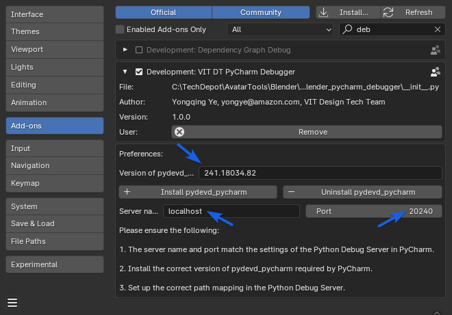
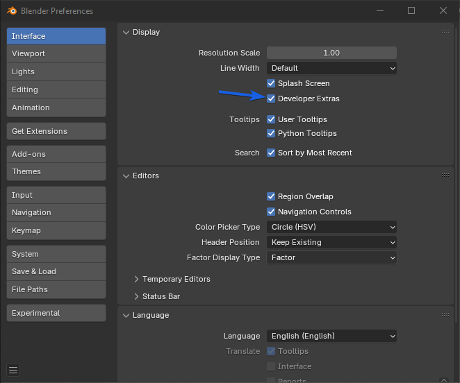
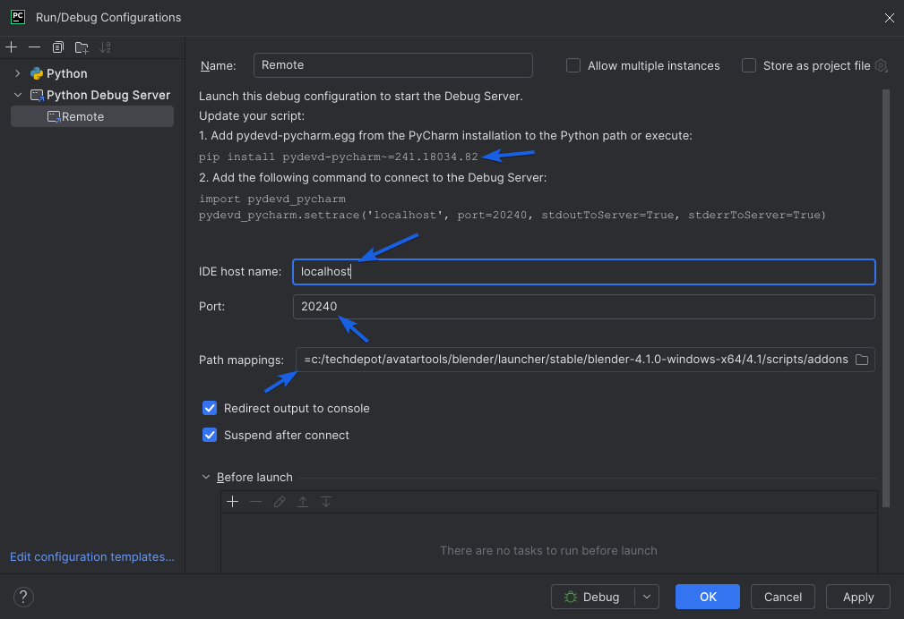
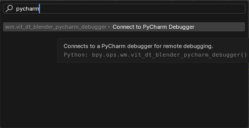

This package is a Blender addon designed to simplify remote debugging with PyCharm for Blender developers. It allows you to connect Blender to PyCharm's Python debugger, allowing you to debug any code you run as addon in PyCharm. This addon requires the version of Blender to be 3.0 or later.

# Installation
To install the addon, clone this repo and find the zipped addon file in the "dist" directory. Run Blender and go to the Preferences windos, install the addon from the zip file.

# Configure Addon
Before using the addon, you need to configure the addon. There are 3 settings you need to set, as shown in the following screenshot:



1. The version of the pydevd_pycharm package your PyCharm uses. This must match the version required by PyCharm.
2. The server name of the Python Debug Server in PyCharm. This must match the Python Debug Server settings in PyCharm.
3. The port number of the Python Debug Server in PyCharm. This must match the Python Debug Server settings in PyCharm.

You can use the "Install" and "Uninstall" buttons to install and uninstall the pydevd_pycharm package. This provides a convenient way to manage the required pydevd_pycharm version. The library will be installed in Blender's Python environment.

The last step is to enable the "Developer Extras" option in the Interface section of the Preferences window. This addon is a development addon, so it requires the "Developer Extras" to be enabled, otherwise it won't be available in the search dialog. This is shown in the following screenshot:




# Configure PyCharm
To configure PyCharm to be connectable with this addon, you need to set up a Python Debug Server. The following steps are required, as shown in the following screenshot:



1. Note the version number of `pydevd_pycharm` shown in the configuration window. This must match the version number set in the addon preferences.
2. Set the host to match the host specified in the addon preferences.
3. Set the port to match the port specified in the addon preferences.
4. Set path mappings for your local and remote code. More explanation below.

# Path Mappings
Path mappings are essential for remote debugging. This is necessary because the code running in Blender is often not the same file you loaded and intend to debug in PyCharm. The usual setup is you keep the source code in your local path, likely a git repo, and install a copy of the source code files in Blender as an addon. Then you create a path mapping between these 2 paths so PyCharm can map the code running in Blender to the source code in your local path. For example, we have these paths:

Local path: `c:\TechDepot\DT_Packages\VitDtBlenderPyCharmDebugger\src\vit_dt_blender_pycharm_debugger\`

Remote path: `c:\TechDepot\Blender\Launcher\stable\blender-4.1.0-windows-x64\4.1\scripts\addons\vit_dt_blender_pycharm_debugger`

A pair of path mappings would be

Local path: `c:/techdepot/dt_packages/vitdtblenderpycharmdebugger/src`

Remote path: `c:/techdepot/blender/launcher/stable/blender-4.1.0-windows-x64/4.1/scripts/addons`

Please note, there are a few caveats to path mappings:
1. The paths must be absolute paths using forward slashes.
2. The paths must be lowercase.
3. The paths must be normalized, meaning no trailing slashes.
4. The paths must be the parent directory of the source code file directories.

# Usage
To use the addon to debug your code, follow these steps:
1. Set up the addon and PyCharm as described above.
2. Add desired breakpoints in your code in PyCharm.
3. Start the Python Debug Server in PyCharm.
4. Start Blender and open the Menu Search dialog (can be invoked by pressing F3, or space bar, or go to menu Edit/Menu Search), and type "Pycharm", then run the "Connect to PyCharm Debugger" command, as shown in the following screenshot:
 


An alternative way to launch it is to run this command in the Blender console:

```
bpy.ops.wm.vit_dt_blender_pycharm_debugger()
```

This is equivalent to running the command from the search dialog.
 
If you have set up everything correctly, you should see a message in the Blender console that says "Connected to PyCharm Debugger". Now you can run your code in Blender and the breakpoints in PyCharm should be hit.

# Known Issues
There's a known issue with pydev_pycharm running in Blender. For each Blender session, it can only connect to the PyCharm debugger once. If it disconnects for any reason, you need to restart Blender to connect again.

# Developer Section

## Building the Addon
This addon was built using a custom script included in this package, "build_addon.py" at the root of the package. To build the addon, you would need a venv created for this package following our DT Python library development guidelines and run the script with the following Poetry command: 

```
poetry run build_addon
```

It will pack the addon into a zip file in the "dist" directory. You can then install the addon from the zip file in Blender.

## Managing Versions
The zip file will include the version number of the addon, so you can easily track which version you are using. The build-addon script uses the version number defined in the `pyproject.toml` file.

We typically include all the built .zip files under the "dist" directory in the git repo to allow the users to download the zip files directly from code.amazon.com.

Per our Python development guidelines, we will also use a git tag to mark the version of the package on a specific git commit. The tag should match the version number in the `pyproject.toml` file. This is to ensure we can track the version of the package in the git repo.